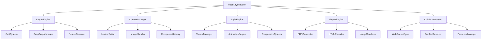

# 📐 QWANYX Page Layout Editor - Roadmap & Vision

## 🎯 Vision
Créer un éditeur de mise en page professionnel dans le navigateur, comparable à InDesign/Canva, mais open-source et intégré dans l'architecture QWANYX.

## 📍 État Actuel (15 Août 2025)

### ✅ Fonctionnalités Implémentées
- **Éditeur Lexical par zone** : Chaque zone de contenu est un éditeur riche complet
- **Toolbar partagée** : Une seule toolbar qui affecte la zone active
- **Formats de page** : A4, A3, A5 (portrait/paysage), formats web et devices
- **Templates prédéfinis** : Journal, Magazine, Blog
- **Indicateurs de débordement** : Alerte visuelle quand le texte dépasse en mode print
- **Système de colonnes** : Support pour layouts multi-colonnes (2, 3, 4 colonnes)
- **Zoom et navigation** : Contrôles de zoom, navigation entre pages
- **Grid system** : Utilisation de CSS Grid pour layouts complexes

### 📁 Structure du Code
```
packages/qwanyx-editor/
├── src/
│   ├── components/
│   │   ├── PageLayoutEditor.tsx    # Composant principal
│   │   ├── RichTextEditor.tsx      # Éditeur Lexical avec ref support
│   │   └── Toolbar.tsx              # Toolbar Lexical
│   ├── types/
│   │   └── PageFormats.ts          # Définitions formats et templates
│   ├── plugins/
│   │   └── SimpleColumnsPlugin.tsx # Plugin colonnes pour Lexical
│   └── styles/
│       ├── editor.css               # Styles éditeur Lexical
│       └── page-layout.css         # Styles layout editor
```

## 🚀 Phase 1: Fondations (COMPLÉTÉ)
- [x] Intégration Lexical dans chaque zone
- [x] Toolbar unifiée contextuelle
- [x] Indicateurs de débordement
- [x] Support des formats print/web
- [x] Templates de base

## 🎨 Phase 2: Éditeur Visuel Avancé (PRIORITÉ HAUTE)

### 2.1 Drag & Drop des Zones
```typescript
interface DraggableZone {
  id: string
  gridArea: string
  isResizable: boolean
  minWidth?: number
  minHeight?: number
  aspectRatio?: number
}
```
- Réorganiser les zones par drag & drop
- Redimensionner les zones avec poignées
- Snap-to-grid pour alignement parfait
- Preview en temps réel pendant le drag

### 2.2 Gestionnaire d'Images
```typescript
interface ImageManager {
  upload: (file: File) => Promise<string>
  crop: (imageUrl: string, cropData: CropData) => Promise<string>
  resize: (imageUrl: string, dimensions: Dimensions) => Promise<string>
  filters: ImageFilter[]
}
```
- Upload d'images avec preview
- Crop et resize intégré
- Filtres basiques (luminosité, contraste, saturation)
- Optimisation automatique pour web/print
- Intégration S3/Cloudinary

### 2.3 Styles Avancés par Zone
```typescript
interface ZoneStyles {
  backgroundColor?: string
  backgroundImage?: string
  backgroundBlendMode?: string
  border?: BorderStyle
  borderRadius?: number
  padding?: Spacing
  shadow?: ShadowStyle
  opacity?: number
  transform?: Transform3D
}
```
- Panel de styles par zone
- Backgrounds gradients/patterns
- Effets visuels (ombres, bordures)
- Animations au survol

## 📝 Phase 3: Fonctionnalités Éditoriales

### 3.1 Gestion du Texte Avancée
- **Text Flow** : Flux de texte entre zones liées
- **Styles de caractères** : Création de styles réutilisables
- **Styles de paragraphes** : Templates de mise en forme
- **Hyphenation** : Césure automatique pour justification
- **Ligatures** : Support des ligatures typographiques
- **Drop caps** : Lettrines pour débuts de paragraphes

### 3.2 Master Pages & Composants
```typescript
interface MasterPage {
  id: string
  name: string
  layout: GridTemplate
  defaultContent: PageContent[]
  isLocked: boolean
}
```
- Pages maîtres réutilisables
- Composants personnalisés sauvegardables
- Bibliothèque de composants partagés
- Verrouillage de zones

### 3.3 Guides & Alignement
- Règles et guides personnalisables
- Smart guides (alignement automatique)
- Grilles de base typographique
- Magnétisme des objets

## 🎯 Phase 4: Collaboration & Workflow

### 4.1 Système de Versions
```typescript
interface Version {
  id: string
  timestamp: Date
  author: User
  changes: Change[]
  snapshot: PageState
  comment?: string
}
```
- Historique complet des modifications
- Comparaison de versions
- Rollback à une version antérieure
- Branches pour variations

### 4.2 Collaboration Temps Réel
- Curseurs multiples (comme Figma)
- Commentaires sur zones
- Annotations et révisions
- Présence en temps réel (qui édite quoi)

### 4.3 Workflow Editorial
- Statuts de publication (brouillon, en révision, approuvé)
- Assignation de tâches
- Notifications de changements
- Approbations en cascade

## 💾 Phase 5: Import/Export & Intégrations

### 5.1 Formats d'Export
```typescript
interface ExportOptions {
  format: 'pdf' | 'html' | 'png' | 'svg' | 'json'
  quality?: 'draft' | 'proof' | 'print'
  colorSpace?: 'rgb' | 'cmyk'
  bleed?: number
  cropMarks?: boolean
  compression?: CompressionLevel
}
```
- **PDF** : Export haute qualité avec options print
- **HTML** : Site web statique responsive
- **Images** : PNG/JPG/SVG par page
- **JSON** : Format de sauvegarde propriétaire

### 5.2 Formats d'Import
- **Word/Google Docs** : Import avec conservation styles
- **Markdown** : Conversion intelligente
- **InDesign IDML** : Compatibilité basique
- **Sketch/Figma** : Import de designs

### 5.3 Intégrations API
- **Google Fonts** : Accès direct aux fonts
- **Unsplash/Pexels** : Banques d'images
- **OpenAI** : Génération de contenu
- **DeepL** : Traduction automatique

## 🔧 Phase 6: Optimisations & Performance

### 6.1 Rendering Engine
```typescript
interface RenderingEngine {
  virtualScrolling: boolean
  lazyLoading: boolean
  webGL: boolean
  offscreenCanvas: boolean
  worker: WebWorker
}
```
- Virtual scrolling pour documents longs
- Web Workers pour calculs lourds
- WebGL pour effets visuels
- Caching intelligent

### 6.2 Architecture Modulaire
- Lazy loading des features
- Code splitting par route
- Tree shaking agressif
- Bundle size optimization

## 🎓 Phase 7: Features Avancées

### 7.1 Templates Marketplace
- Store de templates communautaires
- Système de notation/reviews
- Monétisation pour créateurs
- License management

### 7.2 AI-Powered Features
```typescript
interface AIFeatures {
  autoLayout: (content: Content[]) => GridTemplate
  colorSuggestions: (brand: Brand) => ColorPalette
  fontPairing: (primaryFont: Font) => Font[]
  contentGeneration: (prompt: string) => string
  imageGeneration: (prompt: string) => ImageUrl
}
```
- Suggestions de mise en page par IA
- Génération de contenu contextuel
- Optimisation automatique des layouts
- Correction typographique intelligente

### 7.3 Print Production
- Gestion CMYK native
- Preflight check
- Color profiles (ICC)
- Imposition pour impression
- Marks de coupe et fond perdu

## 📊 Architecture Technique Cible



## 🛠️ Stack Technique Recommandée

### Frontend
- **React 18+** : Pour concurrent features
- **Lexical** : Éditeur de texte riche
- **Fabric.js** : Manipulation d'images
- **React-Grid-Layout** : Système de grille avancé
- **React-DnD** : Drag and drop
- **Zustand** : State management
- **React Query** : Data fetching

### Backend
- **Node.js + Express** : API server
- **PostgreSQL** : Base de données principale
- **Redis** : Cache et sessions
- **S3/Cloudinary** : Stockage images
- **Socket.io** : Temps réel
- **Bull** : Queue pour jobs lourds

### Services
- **Puppeteer** : Génération PDF
- **Sharp** : Traitement d'images
- **ElasticSearch** : Recherche dans contenus
- **WebRTC** : Collaboration P2P

## 📈 KPIs de Succès

1. **Performance**
   - Time to Interactive < 3s
   - FPS > 30 pendant drag/resize
   - Bundle size < 500KB (initial)

2. **Utilisation**
   - 1000+ layouts créés/mois
   - 50+ templates communautaires
   - 4.5+ rating moyen

3. **Qualité**
   - 0 data loss incidents
   - 99.9% uptime
   - < 1% crash rate

## 🎯 Prochaines Étapes Immédiates

1. **Implémenter Drag & Drop basique** (1 semaine)
   - Utiliser react-grid-layout
   - Zones repositionnables
   - Sauvegarde des positions

2. **Ajouter upload d'images** (3 jours)
   - Input file avec preview
   - Stockage local/base64 pour POC
   - Insertion dans zones image

3. **Panel de styles par zone** (1 semaine)
   - Sidebar avec propriétés CSS
   - Color picker
   - Preview temps réel

4. **Export PDF basique** (3 jours)
   - Utiliser jsPDF ou react-pdf
   - Conserver mise en page
   - Options qualité

## 💡 Notes d'Architecture

### Principes de Design
- **Composabilité** : Tout est un composant réutilisable
- **Extensibilité** : Architecture plugin-friendly
- **Performance** : Optimisé pour documents lourds
- **Accessibilité** : WCAG AAA compliance
- **Responsive** : Fonctionne sur tous devices

### Décisions Techniques
- Préférer CSS Grid à Flexbox pour layouts complexes
- Utiliser Web Workers pour calculs lourds
- Virtual DOM pour grandes listes
- IndexedDB pour cache local
- Service Workers pour offline

### Points d'Attention
- Gestion mémoire avec grands documents
- Compatibilité navigateurs (surtout Safari)
- Sync conflicts en collaboration
- CORS pour ressources externes
- Rate limiting sur API calls

## 🔗 Ressources & Inspiration

### Produits Similaires
- **Canva** : UX/UI reference
- **Figma** : Collaboration temps réel
- **InDesign** : Features professionnelles
- **Webflow** : No-code approach
- **Framer** : Animations et interactions

### Libraries Utiles
- **Tiptap** : Alternative à Lexical
- **Konva** : Canvas manipulation
- **PDF.js** : Rendering PDF
- **Tesseract.js** : OCR in browser
- **Comlink** : Web Workers simplifiés

### Documentation
- [Lexical Docs](https://lexical.dev)
- [CSS Grid Guide](https://css-tricks.com/snippets/css/complete-guide-grid/)
- [Print CSS](https://www.smashingmagazine.com/2018/05/print-stylesheets-in-2018/)
- [Web Performance](https://web.dev/performance/)

---

💪 **Let's build something amazing!**

Ce document est un guide vivant. Il évoluera au fur et à mesure du développement du projet.

Dernière mise à jour: 15 Août 2025